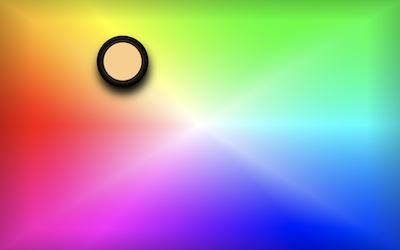
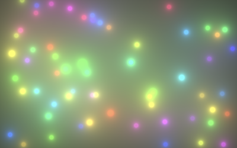
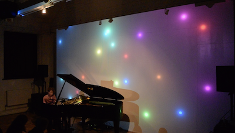

# Hearing Colour App: An interactive music visualiser 

The colour app consists of two parts:

- The colour picker: React app contained in [public](public) and [src](src)  
- The visualiser: p5.js and webGL animation contained in [visualiser](visualiser) 

The audience can use the colour picker to submit a colour which will then be displayed as a moving, coloured blob in the visualiser. If a user picks a new colour their respective blob will change colour and direction. If no new colour is submitted within 60 seconds the respective blob will fade out. 

The app was created for the event [*HEARING COLOUR: SONIC WORLDS AND OTHER SENSES*](https://iklectikartlab.com/hearing-colour-sonic-worlds-and-other-senses/) at Iklectik in London in autumn 2021, where the audience could use it to visualise a live performance in real-time.  



## Data storage

The data from the audience is saved on a [Firebase](http://firebase.google.com/) Realtime Database in the following format: 
	
```
// All submissions from unique users are saved 
{ UserId : 	{
            timestamp: hsl-colour string;
            timestamp: hsl-colour string;
            .
            .
            .
            }
.
.
.
}
 
// In addition, the last submission (if newer than 60 seconds) for each user is stored separately 
{currentBlobs:	{
                UserId: {‘colour’: hsl-colour-string; timestamp’: int }
                UserId: {‘colour’: hsl-colour-string; timestamp’: int }
                .
                .
                .
                }
}
```

## Colour Picker
The Colour Picker was created with [Create React App](https://github.com/facebook/create-react-app). and uses a canvas element to display a colour space. If a user clicks anywhere on the canvas, a circle with the selected colour will appear above the click position. In order to submit the colour, the user has to wait for 1.5 seconds until the submission animation is completed and the circle disappears. The user can move around on the canvas while the submission animation is showing. 

## Visualiser
The visualiser is implemented in [p5.js](https://p5js.org/) and webGL. It uses an isosurface sometimes called Metaballs to visualise the colour submissions from the audience. For performance reason the number of blobs is limited to 100. 


Key controls:
- r : resets the currentBlobs object on the database but keeps the remaining submissions 	
- x : resets the database and deletes all entries 
- \+ : increases the size of the blobs 
- \- : decreases the size of the blobs